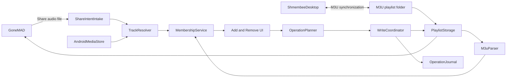
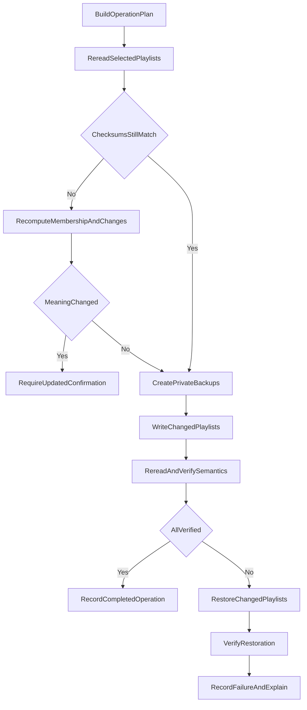
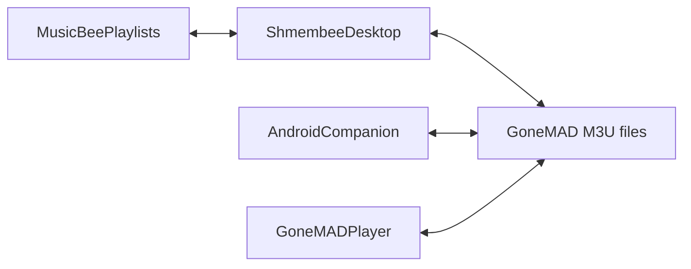

# Shmembee Playlist Companion

## Purpose

Build a small native Android companion app that gives GoneMAD a Musicolet-style
playlist-management interface without replacing GoneMAD as the music player.

The companion is intended to solve a specific workflow problem:

> While a song is playing, quickly see which M3U playlists contain it, then add
> it to or remove it from several playlists at once.

GoneMAD remains responsible for playback, audio focus, MediaSession, Bluetooth
controls, Android Auto, equalization, library scanning, and its queue. The
companion edits the same M3U/M3U8 files used by GoneMAD and synchronized by
Shmembee.

The Android app should live in a separate repository. The two projects should
share documented behavior and golden test fixtures, not .NET assemblies or
source code.

## Product boundaries

### Initial release

- Receive the currently playing audio file through GoneMAD's **Share → File**
  action.
- Let the user grant persistent access to GoneMAD's playlist directory.
- Scan M3U and M3U8 files and determine which contain the shared track.
- Present separate **Add** and **Remove** tabs.
- Visually emphasize playlists that already contain the track.
- Select several playlists at once.
- Add one occurrence to selected playlists without accidental duplicates.
- Remove all occurrences from selected playlists.
- Show duplicate occurrence counts.
- Back up, write, reread, and semantically verify every changed playlist.
- Roll back a partially failed batch.
- Offer safe undo.
- Preserve compatibility with GoneMAD and desktop Shmembee.

### Explicitly out of scope

- Audio playback or replacing GoneMAD
- Multiple playback queues
- Equalizer, lyrics, tags, widgets, and Android Auto
- Direct MusicBee communication
- Full library browsing in the first release
- Full playlist reordering in the first release
- Depending on undocumented GoneMAD internals

Keeping playback out of scope is what makes this a focused companion instead of
a multi-year music-player project.

## Primary experience

### Remove the current track

1. Play a track in GoneMAD.
2. Choose **Share → File**.
3. Choose **Shmembee Playlist Companion** in the Android share sheet.
4. The companion opens directly to the shared track.
5. Open the **Remove** tab.
6. Select several playlists containing the track.
7. Tap **Remove from N playlists**.
8. The companion safely updates and verifies the selected M3Us.
9. Show a concise result with **Undo**.
10. Close the companion or return to GoneMAD.

Conceptual screen:

```text
┌────────────────────────────────────────┐
│ ←  Green Lights                       │
│    Sarah Jarosz · World on the Ground │
├────────────────────────────────────────┤
│          ADD          REMOVE           │
│                        ━━━━━━          │
├────────────────────────────────────────┤
│ Search playlists…                     │
├────────────────────────────────────────┤
│ ☑  Driving                            │
│ ☑  Current Favorites                  │
│ ☐  Folk                               │
│ ☑  Listen Later                       │
│ ☐  Relaxing                           │
├────────────────────────────────────────┤
│          Remove from 3 playlists      │
└────────────────────────────────────────┘
```

### Add tab

- Show playlists that contain the track first..
- Show existing memberships in bold or with an explicit indicator.
- Permit multi-selection.
- Prevent duplicate additions by default.
- Allow intentional duplicate insertion only through an explicit secondary
  action.
- Append new entries in the initial release.

### Remove tab

- Show playlists containing the track first and bold their titles.
- Show existing memberships in bold or with an explicit indicator.
- Permit multi-selection.
- Show occurrence counts such as `Driving 2×`.
- Remove all occurrences by default.
- State the operation clearly on the confirmation button.
- Preserve the order of every remaining entry.

### Interaction details

- Remember the last-used tab.
- Search playlist names.
- Support **Select all visible** and **Clear selection**.
- Optionally toggle between relevant playlists and all playlists.
- Auto-return to GoneMAD after a successful quick operation, if enabled.
- Keep the result open when a write fails.
- Offer immediate undo.

## Architecture

Use:

- Kotlin
- Jetpack Compose and Material 3
- Android Storage Access Framework
- Android `ACTION_SEND` handling
- MediaStore for metadata and identity fallback
- Kotlin coroutines
- Room for settings, aliases, operations, and undo history
- SHA-256 from the standard Java/Kotlin cryptography APIs

React Native and Capacitor are not preferred because nearly all important work
is Android-specific: share intents, content URIs, persisted storage grants,
document providers, MediaStore, and process lifecycle.

Suggested separate-repository layout:

```text
shmembee-playlist-companion/
├── app/
│   └── src/main/
│       ├── AndroidManifest.xml
│       ├── java/.../
│       │   ├── intake/
│       │   ├── playlists/
│       │   ├── tracks/
│       │   ├── operations/
│       │   ├── storage/
│       │   ├── ui/
│       │   └── settings/
│       └── res/
├── contract-fixtures/
│   ├── m3u/
│   ├── normalization/
│   ├── checksums/
│   └── operations/
├── docs/
│   ├── product-requirements.md
│   ├── m3u-contract.md
│   ├── track-identity.md
│   ├── write-safety.md
│   └── gonemad-integration.md
└── README.md
```

Data flow:



Conceptual internal boundaries:

```kotlin
interface SharedTrackIntake {
    suspend fun receive(intent: Intent): SharedTrack
}

interface PlaylistRepository {
    suspend fun listPlaylists(): List<PlaylistDescriptor>
    suspend fun readPlaylist(id: PlaylistId): PlaylistDocument
}

interface TrackMatcher {
    suspend fun matches(
        sharedTrack: SharedTrack,
        entry: PlaylistEntry
    ): MatchResult
}

interface PlaylistOperationCoordinator {
    suspend fun apply(
        request: PlaylistOperationRequest
    ): PlaylistOperationResult

    suspend fun undo(operationId: UUID): PlaylistOperationResult
}
```

## GoneMAD integration

GoneMAD supports sharing the playing track as text or as the actual audio file.
The companion must receive the file. Artist and title text alone cannot safely
distinguish remasters, alternate encodings, disc-specific copies, or tracks with
identical metadata.

The Android manifest should register an activity for shared audio:

```xml
<intent-filter>
    <action android:name="android.intent.action.SEND" />
    <category android:name="android.intent.category.DEFAULT" />
    <data android:mimeType="audio/*" />
</intent-filter>
```

The intake layer must handle:

- `content://` URIs
- Older or unusual `file://` URIs
- Generic or missing MIME types
- Temporary read grants
- URIs without an exposed filesystem path

The first proof of concept should inspect the exact payload shared by the
installed GoneMAD version on the target phone.

## Playlist-folder access

On first launch:

1. Explain why folder access is necessary.
2. Open Android's system folder picker.
3. Ask the user to select GoneMAD's playlist directory.
4. Persist the document-tree permission.
5. Validate read and write access.
6. Test create, update, rename, and delete capabilities with a disposable file.
7. Discover `.m3u` and `.m3u8` files case-insensitively.
8. Report the recognized playlist count.

The likely folder is:

```text
Internal storage/gmmp/playlists
```

Do not hardcode it. Persist the selected document-tree URI.

A diagnostics view should report the selected directory, recognized playlist
count, available file operations, last scan, and last verified write.

## M3U compatibility contract

Port Shmembee's established behavior independently to Kotlin. Relevant desktop
references:

- `src/Shmembee.Infrastructure/Playlists/M3uPlaylistParser.cs`
- `src/Shmembee.Infrastructure/Playlists/DeterministicM3uWriter.cs`
- `src/Shmembee.Core/Paths/TrackPathNormalizer.cs`
- `src/Shmembee.Application/Synchronization/PlaylistChecksum.cs`
- `docs/gonemad-contract.md`

Share a versioned specification and golden fixtures between repositories rather
than attempting to run .NET code on Android.

### Parser behavior

- Accept `.m3u` and `.m3u8`.
- Decode UTF-8 strictly.
- Accept an optional UTF-8 BOM.
- Ignore blank lines and ordinary comments.
- Recognize optional `#EXTINF` records.
- Preserve source order and duplicate occurrences.
- Retain raw source paths and source line numbers for diagnostics.
- Normalize paths for comparison without destructively rewriting them on read.

### Writer behavior

- UTF-8 without BOM
- LF line endings
- A trailing newline
- Stable entry order
- Duplicate preservation unless the requested operation removes them
- `/` path separators for generated paths
- Rejection of entries containing line breaks
- No writes to unaffected playlists
- No silent deduplication, reordering, or canonicalization of unrelated entries

### Semantic checksum

Calculate stale-input and verification checksums over ordered, normalized
entries:

```text
lowercase-hex(
    SHA-256(
        UTF-8(entry0 + "\n" + entry1 + ...)
    )
)
```

There is no trailing newline in the checksum input. An empty playlist hashes the
empty byte sequence. Compare semantic content rather than raw bytes because
GoneMAD may rewrite formatting.

## Track identity and matching

Track identity is the largest technical risk. Prefer evidence in this order:

1. Exact persisted document URI, when meaningful
2. Exact storage-relative path
3. Exact normalized M3U path
4. Unique path suffix
5. Unique filename with parent-directory evidence
6. Unique MediaStore identity
7. Strong artist, title, album, and duration match
8. User resolution when still ambiguous

Never silently select one of several candidates.

Suggested intake model:

```kotlin
data class SharedTrack(
    val contentUri: Uri,
    val displayName: String?,
    val storageRelativePath: String?,
    val artist: String?,
    val title: String?,
    val album: String?,
    val durationMs: Long?,
    val mediaStoreId: Long?
)
```

Normalization must account for:

- `/storage/emulated/0/`
- `/sdcard/`
- Relative entries
- Leading `./`
- `.` and `..` segments
- Slash direction
- URI encoding
- Internal versus removable storage
- GoneMAD's configured music roots

Android storage can be case-sensitive, while some existing desktop behavior is
case-insensitive. Version the normalization contract and cover changes with
fixtures before altering existing semantics.

When the user manually resolves ambiguity, retain an approved alias between the
shared Android identity and normalized M3U path. Invalidate aliases when the
underlying file no longer exists or changes materially.

## Membership calculation

For every playlist:

1. Parse the document.
2. Normalize each entry.
3. Compare entries with the shared track.
4. Record all matching occurrence positions.
5. Compute the semantic checksum.
6. Return membership and any warning.

```kotlin
data class PlaylistMembership(
    val playlistId: PlaylistId,
    val displayName: String,
    val containsTrack: Boolean,
    val occurrenceIndexes: List<Int>,
    val semanticChecksum: String,
    val warning: MembershipWarning?
)
```

Perform scanning off the UI thread. Caching may use the document URI, modified
time where trustworthy, size, and previous checksum. Never use the cache as a
write precondition; reread every selected playlist before mutation.

## Add and remove semantics

### Add

- Add one occurrence to each selected playlist.
- Append in the initial release.
- Skip an existing membership by default.
- Report playlists skipped because their state changed.
- Prefer the playlist's dominant path style when writing.
- Require a configured default when the playlist's style is mixed or ambiguous.

Future options may include inserting at the beginning, inserting at a chosen
position, and explicitly allowing duplicates.

### Remove

- Remove every occurrence from each selected playlist by default.
- Preserve all remaining entry order.
- Report the number removed per playlist.
- Cleanly skip playlists where another process already removed the track.

Choosing individual occurrences can be a later advanced feature.

## Safe write protocol

Android document providers do not guarantee atomic sibling replacement. Use
optimistic concurrency, private backups, semantic verification, and
compensating rollback.



Before writing:

- Reread every selected playlist.
- Compare current semantic checksums with the displayed state.
- Recompute if anything changed.
- Ask for confirmation again only if the effective operation changed.
- Save original bytes in app-private storage.
- Record whether every target originally existed.

During writing:

- Modify only selected playlists.
- Assign one operation ID to the batch.
- Record which files have changed.
- Stop on an unrecoverable write or verification failure.
- Retain backups until the operation is accepted.

After writing:

- Reread and parse every changed playlist.
- Verify its expected ordered semantic checksum.
- On batch failure, restore every changed playlist.
- Verify restoration.
- Preserve diagnostics if apply or restoration fails.

This is a compensating transaction, not a true filesystem transaction.

## Undo

Record:

- Operation ID and timestamps
- Shared track identity
- Action
- Playlist document URIs and names
- Previous and resulting checksums
- Backup locations
- Added or removed occurrence positions
- Apply and restoration verification results
- Final status

Undo must perform its own stale-input check. If GoneMAD or Shmembee has changed a
playlist since the operation, do not blindly restore the old file. Invert only
the original operation against the new state when unambiguous; otherwise require
review.

## GoneMAD refresh behavior

Test on the actual phone:

- Whether GoneMAD detects an external M3U edit immediately
- Whether reopening the playlist reloads it
- Whether a library or playlist rescan is required
- Whether an open playlist is cached
- Whether GoneMAD can later overwrite the companion's edit from stale memory
- Whether behavior differs for the actively playing playlist
- Whether any documented GoneMAD intent can request a refresh

Until established, show conservative guidance:

> Updated 3 playlists. Reopen the playlist in GoneMAD if its contents do not
> refresh immediately.

## Screens

### Setup

- Explain the product boundary.
- Select and validate the playlist directory.
- Display the detected playlist count.
- Run a disposable read/write/restore capability test.
- Link to diagnostics.

### Shared-track membership

- Title, artist, album, and filename
- Add and Remove tabs
- Search
- Existing-membership styling
- Occurrence counts
- Multi-selection
- Clear action wording
- Scan progress
- Warnings for ambiguous matches and malformed playlists

### Track resolution

Show only when identity is uncertain:

- Shared track details
- Candidate matches
- Evidence for each candidate
- **Remember this match**
- Cancel without mutation

### Result

- Playlists changed and skipped
- Occurrences added or removed
- Undo
- Return to GoneMAD
- Expandable failure diagnostics

### Settings and diagnostics

- Playlist directory
- Preferred output path style
- Duplicate behavior
- Removal behavior
- Auto-close preference
- Operation history
- Approved aliases
- Diagnostic export
- Contract version

## Delivery milestones

### Milestone 0: contract capture

- Define parser, writer, normalization, and checksum contract versions.
- Produce shared golden fixtures from Shmembee.
- Include Unicode, duplicates, comments, `EXTINF`, absolute and relative paths,
  malformed UTF-8, and empty playlists.
- Run equivalent fixtures in C# and Kotlin.

Exit condition: both implementations agree on every defined contract case.

### Milestone 1: GoneMAD intake proof

- Appear in GoneMAD's Share File sheet.
- Receive and display the URI, MIME type, filename, accessible metadata, and
  MediaStore information.
- Confirm that the shared stream can be read.
- Test several formats and storage locations.

Exit condition: the playing track can be identified reliably enough for
playlist matching.

### Milestone 2: read-only membership proof

- Add playlist-directory selection and persisted permission.
- Discover and parse M3Us.
- Normalize paths and match the shared track.
- Display the complete read-only membership interface.
- Do not write anything.

Exit condition: membership is correct across all real playlists and edge cases.

### Milestone 3: disposable write proof

Restrict writes to:

```text
Shmembee Companion Test.m3u
```

Implement backups, add, remove, verification, rollback, and operation history.
Test duplicates, failures, and GoneMAD refresh behavior.

Exit condition: repeated device tests prove safe mutation and recovery.

### Milestone 4: multi-playlist MVP

- Enable real playlists.
- Add separate Add and Remove tabs.
- Add multi-selection and search.
- Implement batch write and rollback.
- Show duplicate occurrence counts.
- Add undo and optional auto-return to GoneMAD.

Exit condition: removing the current track from several real playlists is
dependable and faster than manually opening each playlist.

### Milestone 5: hardening

Test:

- Large playlists and at least 40 playlists
- Unicode and punctuation-heavy paths
- Internal and removable storage
- Concurrent GoneMAD edits
- Shmembee synchronization before and after phone edits
- Permission revocation
- Full storage
- Process death during a write
- Malformed M3Us
- Missing or renamed tracks
- Duplicate filenames and occurrences
- Rotation and process recreation
- Different supported Android versions

Add next-launch recovery for interrupted operations.

### Milestone 6: convenience integrations

Only after the share workflow is dependable:

- Pinned direct-share target
- Launcher shortcut
- Quick Settings tile
- MediaSession or notification-assisted current-track detection
- Return-to-GoneMAD action
- Full playlist editing
- Multi-track operations

Metadata-only shortcuts must ask the user when matching is ambiguous. Keep
**Share → File** as the exact, reliable route.

## Testing

### Unit tests

- UTF-8 and BOM behavior
- Comments, `EXTINF`, and blank lines
- Relative and absolute paths
- Separator and segment normalization
- Unicode
- Duplicate occurrences
- Semantic checksums
- Add and remove transformations
- Output path-style selection
- Ambiguous track matching
- Operation inversion for undo

### Cross-repository contract tests

Use matching fixture inputs and expected outputs in Shmembee and the Android
repository:

- GoneMAD-generated M3U
- Companion-generated M3U
- Shmembee-generated M3U
- GoneMAD-rewritten M3U
- Duplicate playlist
- Unicode playlist
- Empty playlist
- Mixed separators
- Relative and absolute references to the same track

### Android instrumented tests

- Share-intent receipt
- Persisted document-tree permission
- Document-provider reads and writes
- Backup, verification, and restore
- Process recreation
- URI metadata
- UI multi-selection
- Changed-state reconfirmation
- Failure reporting

### Manual device contract log

Record:

- Phone model
- Android version
- GoneMAD version
- Internal or removable storage
- Playlist path
- Shared URI shape
- Refresh behavior
- Duplicate behavior
- Failure modes

## Relationship to desktop Shmembee

The companion does not talk to MusicBee directly:



Shared concepts:

- Ordered playlists
- Duplicate occurrences
- Phone-path normalization
- Semantic checksums
- Optimistic concurrency
- Backup, verification, and rollback
- Ambiguous matches block mutation

Do not directly share:

- .NET assemblies
- MusicBee APIs
- Windows and MTP transports
- Desktop SQLite storage
- Android Room storage

Shmembee should see companion edits as ordinary phone-side M3U changes. A future
sidecar operation log may improve diagnostics, but M3Us must remain sufficient
and authoritative.

## Principal risks

### GoneMAD share payload

The shared content URI might not expose a filesystem path.

Mitigate by inspecting the real intent first, using MediaStore and metadata,
maintaining approved aliases, and never guessing ambiguous identities.

### GoneMAD stale caching

GoneMAD might not immediately reload external changes or could later overwrite
them from stale memory.

Mitigate with disposable integration tests, conservative refresh guidance, and
documented intents where available.

### Document-provider limitations

Rename and replacement may not be atomic or supported.

Mitigate with private backups, semantic verification, compensating rollback, and
durable interrupted-operation state.

### Cross-platform path disagreement

Windows, Android, MTP, GoneMAD, and Shmembee can represent one track differently.

Mitigate with versioned normalization, fixtures, preserved raw paths, approved
aliases, and ambiguity blocking.

### Scope expansion

The companion could slowly become another music player.

Mitigate by keeping playback out of scope and judging features by whether they
improve external M3U management.

## MVP acceptance criteria

- GoneMAD can share the playing file to the companion.
- The companion identifies it without unsafe guessing.
- The companion scans the selected playlist directory.
- Membership is accurate.
- Existing memberships are visually distinct.
- Add and Remove are separate tabs.
- Several playlists can be selected.
- One action removes all occurrences from selected playlists.
- One action adds the track without accidental duplicates.
- Unselected playlists remain byte-for-byte untouched.
- Selected playlists preserve unrelated order and duplicates.
- Every write is backed up and semantically verified.
- A partial batch failure triggers verified rollback.
- Undo handles concurrent changes safely.
- GoneMAD consumes the resulting files.
- Desktop Shmembee parses and reconciles the resulting files.
- The workflow is materially faster than editing each playlist in GoneMAD.

## Recommended first action

Begin with two disposable technical proofs, not the complete interface:

1. Determine the exact URI and metadata GoneMAD sends through **Share → File**.
2. Prove that the companion can read, replace, reread, and restore one disposable
   M3U through the Storage Access Framework.

If both succeed, build the read-only membership screen. Enable writes to real
playlists only after matching accuracy, GoneMAD refresh behavior, verification,
and rollback have passed against the disposable playlist.
